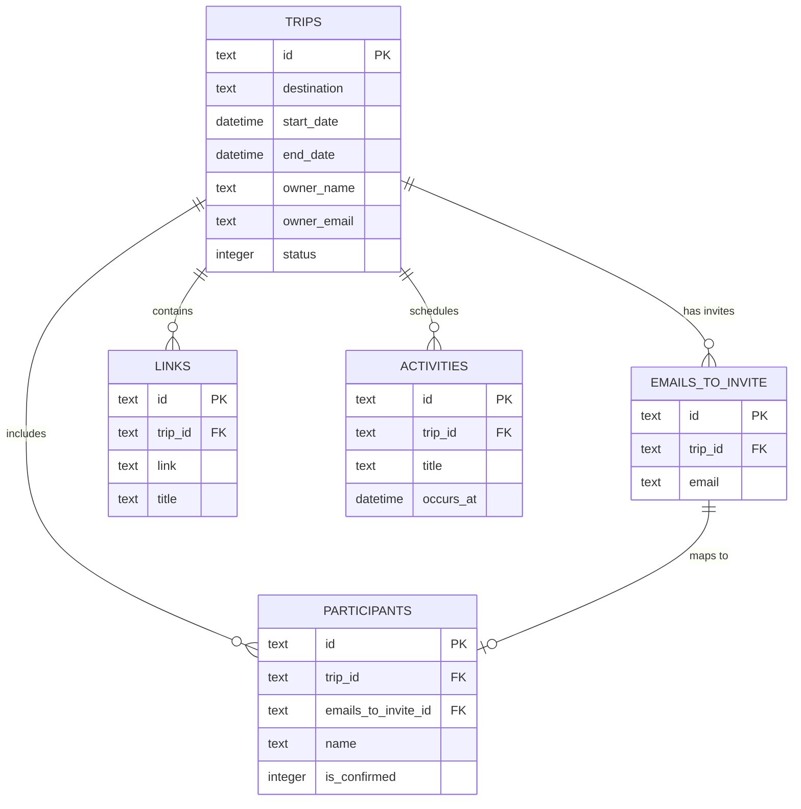

# Travel Assistant API

A RESTful API built with **Flask** and **SQLite3** designed to facilitate group travel planning. The system allows users to create trips, invite participants, schedule daily activities, and share helpful travel links.

This project showcases clean software engineering practices, including structured MVC/repository architecture, automated database bootstrapping, robust input validation, and full containerization.

---

## 🚀 Key Features

* **Layered Architecture**: Decoupled routing, controller (business logic), repository (data access), and driver (external integrations) layers.
* **Database Auto-Initialization (Bootstrapping)**: The SQLite database and its tables are automatically generated on first run using `init/schema.sql`.
* **Business Rule Validation**:
  * Date consistency checks (trip `end_date` must be after `start_date`).
  * Scheduling safety (activities can only be scheduled within the duration of the trip).
  * Email format verification via regular expressions.
* **Global JSON Error Handling**: Intercepts unhandled errors and routes to return clean JSON objects instead of default Flask HTML error pages.
* **Docker Containerization**: Easily runs inside an isolated container with Docker and Docker Compose.

---

## 🏗️ System Architecture & Database Schema

The database model is kept simple and optimized for quick joins between trips, invitees, and scheduled activities.



---

## 🛠️ API Endpoints

### Trips

#### 1. Create a Trip
* **Endpoint**: `POST /trips`
* **Request Body**:
```json
{
  "destination": "Paris, France",
  "start_date": "2026-07-10",
  "end_date": "2026-07-20",
  "owner_name": "John Doe",
  "owner_email": "john.doe@example.com",
  "emails_to_invite": ["jane.doe@example.com", "friend@example.com"]
}
```
* **Response (201 Created)**:
```json
{
  "id": "c3b879c9-59cb-4c57-a9a7-47b8642e5bfa"
}
```

#### 2. Get Trip Details
* **Endpoint**: `GET /trips/<tripId>`
* **Response (200 OK)**:
```json
{
  "trip": {
    "id": "c3b879c9-59cb-4c57-a9a7-47b8642e5bfa",
    "destination": "Paris, France",
    "starts_at": "2026-07-10 00:00:00",
    "ends_at": "2026-07-20 00:00:00",
    "status": 0
  }
}
```

#### 3. Confirm a Trip
* **Endpoint**: `GET /trips/<tripId>/confirm`
* **Response (204 No Content)**: Returns empty response.

---

### Participants & Invites

#### 1. Invite a Participant
* **Endpoint**: `POST /trips/<tripId>/invites`
* **Request Body**:
```json
{
  "name": "Alice Smith",
  "email": "alice.smith@example.com"
}
```
* **Response (201 Created)**:
```json
{
  "participant_id": "8f3b1a2c-f6d3-48e0-b98a-21cb8b77ad0a"
}
```

#### 2. Get Trip Participants
* **Endpoint**: `GET /trips/<tripId>/participants`
* **Response (200 OK)**:
```json
{
  "participants": [
    {
      "id": "8f3b1a2c-f6d3-48e0-b98a-21cb8b77ad0a",
      "name": "Alice Smith",
      "email": "alice.smith@example.com",
      "is_confirmed": 0
    }
  ]
}
```

#### 3. Confirm Participant Attendance
* **Endpoint**: `PATCH /participants/<participantId>/confirm`
* **Response (204 No Content)**: Returns empty response.

---

### Activities

#### 1. Create an Activity
* **Endpoint**: `POST /trips/<tripId>/activities`
* **Request Body**:
```json
{
  "title": "Visit Eiffel Tower",
  "occurs_at": "2026-07-12 14:00:00"
}
```
* **Response (201 Created)**:
```json
{
  "activityId": "472e391b-684f-4d9f-a267-3fa610f4439c"
}
```

#### 2. Get Trip Activities
* **Endpoint**: `GET /trips/<tripId>/activities`
* **Response (200 OK)**:
```json
{
  "activity": [
    {
      "id": "472e391b-684f-4d9f-a267-3fa610f4439c",
      "title": "Visit Eiffel Tower",
      "occurs_at": "2026-07-12 14:00:00"
    }
  ]
}
```

---

### Links

#### 1. Add a Helpful Link
* **Endpoint**: `POST /trips/<tripId>/links`
* **Request Body**:
```json
{
  "title": "Booking Confirmation",
  "url": "https://booking.com/confirmation/12345"
}
```
* **Response (201 Created)**:
```json
{
  "linkId": "b8a8b1cb-7001-4475-ae90-ea4f08e5e8e3"
}
```

#### 2. Get Trip Links
* **Endpoint**: `GET /trips/<tripId>/links`
* **Response (200 OK)**:
```json
{
  "links": [
    {
      "id": "b8a8b1cb-7001-4475-ae90-ea4f08e5e8e3",
      "title": "Booking Confirmation",
      "url": "https://booking.com/confirmation/12345"
    }
  ]
}
```

---

## ⚡ How to Run

### Option A: Using Docker (Recommended)

1. Make sure you have Docker and Docker Compose installed.
2. Build and start the service with:
   ```bash
   docker compose up --build
   ```
3. The API will start on `http://localhost:3000`.

### Option B: Running Locally

1. Create a virtual environment:
   ```bash
   python -m venv venv
   source venv/Scripts/activate   # On Windows
   source venv/bin/activate       # On Linux/macOS
   ```
2. Install the dependencies:
   ```bash
   pip install -r requirements.txt
   ```
3. Run the Flask server:
   ```bash
   python run.py
   ```
4. The database (`storage.db`) will be automatically initialized on the first run, and the API will start on `http://localhost:3000`.
